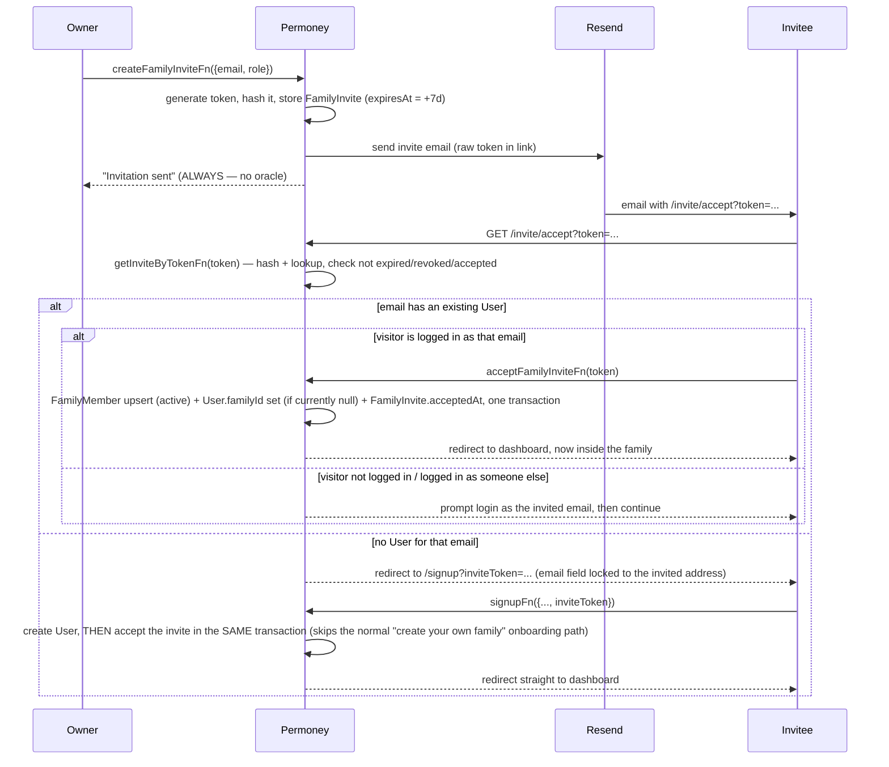

# ADR-0057 — Family invitation by email

|                   |                                                                |
| ----------------- | -------------------------------------------------------------- |
| **Status**        | Accepted                                                        |
| **Date**          | 2026-09-14                                                      |
| **Accepted**      | 2026-09-14                                                      |
| **Deciders**      | Hendri Permana                                                  |
| **Supersedes**    | —                                                                |
| **Superseded by** | —                                                                |
| **Amends**        | ADR-0036 §3 (`FamilyMember.status='invited'` reserved slot, never built) |

## Context

`addMemberForFamily` (`src/server/family-members.ts`) is the only way to add a family member today, and it has two real problems surfaced by a whole-repo coherence audit (CommandCode, 2026-09-13, finding #11):

1. **Email-existence oracle.** The target user must already have a Permoney account (`MemberNotFoundError` if not) — any caller with `member:manage` capability (an owner/admin of *some* family) can probe arbitrary emails and learn from the response whether that email has a Permoney account at all.
2. **Non-consensual auto-join.** If the target user exists but has no active family yet (`User.familyId IS NULL` — freshly signed up, mid-onboarding, or just revoked from another family per the PR #350 fix), inviting them makes them an active member of the inviter's family immediately, with no acceptance step.

ADR-0036 already reserved `FamilyMember.status = 'invited'` for "the future invitation flow" but never built it, and its schema can't actually hold a pending invite for an email with no `User` row yet — `FamilyMember.userId` is a required FK. That gap is why `addMemberForFamily` fell back to "target must already exist" in the first place.

The creator asked for this done as a real, complete feature — comparable to how Sure (this app's original migration source, see ADR-0041) and every mainstream product handles team/family invites — not a minimal patch on the existing endpoint.

## Decision

Build a real email-invitation flow: an owner/admin invites by email; Permoney sends a link; the recipient accepts by logging in (if they already have an account) or signing up through the invite link (if they don't) — either path lands them in the inviter's family, never the inviter's data before they've explicitly agreed.

### New model: `FamilyInvite` (not RLS-scoped, like `Family` and `User`)

```prisma
model FamilyInvite {
  id          String    @id @default(cuid())
  familyId    String
  email       String    // normalized: trim + lowercase
  role        String    @default("member") // 'owner' | 'admin' | 'member' | 'viewer' (DB CHECK, same domain as FamilyMember.role)
  tokenHash   String    @unique // sha256(rawToken), hex — the raw token is NEVER persisted
  invitedById String
  expiresAt   DateTime
  acceptedAt  DateTime?
  revokedAt   DateTime?
  createdAt   DateTime  @default(now())
  updatedAt   DateTime  @updatedAt

  family    Family @relation(fields: [familyId], references: [id], onDelete: Cascade)
  invitedBy User   @relation(fields: [invitedById], references: [id], onDelete: Cascade)

  @@index([familyId, email])
  @@index([email])
}
```

**Why a new table, not reusing `FamilyMember.status='invited'` as ADR-0036 originally sketched:** `FamilyMember.userId` is required — there is no row to create until a `User` exists. `FamilyInvite` deliberately holds only `email` (no `userId`), so it can represent "someone we invited who may not have signed up yet" — the exact case ADR-0036 didn't have a schema for.

**Why NOT RLS-scoped:** the accept-flow's core lookup — "does this raw token from the URL correspond to a live invite?" — runs before the visitor is a member of the target family (that's the entire point of an invite). A `scopedTenantTransaction` can't apply here because there's no membership yet to derive `app.family_id` from. This mirrors the codebase's own existing precedent: `Family` and `User` are *also* not RLS-protected (see `prisma/seed/app-tenant.ts`'s comment: "Family is not RLS-protected (auth-gated)"). Access control for `FamilyInvite` is enforced in application code instead:
- The **token-lookup path** (`getInviteByTokenFn`, `acceptFamilyInviteFn`) is a bearer-capability model: possessing the unguessable 256-bit token *is* the authorization to read that one row, the same trust model as a password-reset link or an email-verification link. `tokenHash` is a SHA-256 digest of 32 cryptographically random bytes (`node:crypto.randomBytes(32).toString("base64url")`) — the raw token is embedded in the email link and never stored; only its hash is persisted, so a database leak alone can't be used to accept invitations.
- The **management path** (list/revoke/resend pending invites) is gated by `requireCapability("member:manage")` plus an explicit `WHERE familyId = context.familyId` in every query, matching how `Family`/`User` reads are already scoped by hand elsewhere in this codebase.

### Flow



**Existing-family conflict:** if, at accept time, the invited user's `User.familyId` is already set to a DIFFERENT family (they're an active member elsewhere), the accept is rejected with a clear error — Permoney's current model is single-family-per-user, so joining a new family first requires leaving the old one (out of scope here; surfaced as an honest error, not a silent no-op or a silent double-membership).

**Invite lifecycle:** `expiresAt` = created + 7 days (matches the common industry default and Better Auth's own session-adjacent token conventions already in this codebase). Owner/admin can see pending invites (email, role, invited-by, expires-at) and revoke or resend one (resend regenerates the token + expiry and re-sends, rather than reusing the old token). An accepted or revoked invite's token is permanently dead — `acceptFamilyInviteFn`/`getInviteByTokenFn` both check `acceptedAt IS NULL AND revokedAt IS NULL AND expiresAt > now()`.

**Rate limiting:** `createFamilyInviteFn` and `resendFamilyInviteFn` go through the existing `checkRateLimit` (`src/server/middleware/rate-limit.ts`), keyed by the inviting user, with a new `"invite"` limiter tier (10 invites / hour is a reasonable ceiling for a family-sized product — this is not a mass-invite SaaS). This is on top of `requireCapability("member:manage")` already gating the endpoint; the limiter exists specifically to blunt email-bombing an arbitrary address, not to gate legitimate family use.

### Email delivery: Resend

No email-sending capability exists anywhere in this codebase today. Resend is the new dependency: simple REST API, a maintained Node SDK, a free tier sufficient for a family-sized product, and first-class support for React-based email templates if this grows later. New server-only module `src/server/email.server.ts` (following the `*.server.ts` hard-fence convention — never imported by client code), reading `RESEND_API_KEY` and `RESEND_FROM_EMAIL` from the environment.

**Fail loudly, not silently**, unlike the rate-limiter's degrade-to-in-memory pattern: email delivery is this feature's entire point, not a defense-in-depth layer. If `RESEND_API_KEY` is unset or the send fails, `createFamilyInviteFn` rolls back the `FamilyInvite` row (same transaction) and returns a clear error to the inviter — never silently "succeeds" with no email actually sent. Local dev without a configured key gets a loud, obvious error the first time an invite is attempted, not a silent no-op discovered days later.

**From-address**: `invites@permana.icu` (or `noreply@permana.icu`), which requires verifying the `permana.icu` sending domain on Resend (SPF/DKIM DNS records added to the existing Cloudflare-managed zone) before the first real send — a one-time manual step for the creator, documented in `docs/runbook-production.md`.

### Signup integration

`signupFn` (`src/server/auth-fns.ts`) gains an optional `inviteToken` input. When present and valid for the signed-up email:
- Skip the normal `redirectTo: "/onboarding"` response.
- In the same database transaction as the invite-accept logic (mirroring `initializeOnboardingForUser`'s shape in `onboarding-service.ts`: lock the row, set the tenant GUC to the invite's family, create the `FamilyMember` row, set `User.familyId`, mark `FamilyInvite.acceptedAt`, write `AuditLog`), then redirect straight to the dashboard.
- If the token turns out invalid/expired/already-accepted at the moment of signup (a race — someone could sign up separately before finishing the invite flow), signup still succeeds as a normal account creation; the invite silently doesn't apply, and the user lands on normal onboarding. Never block account creation on a stale invite token.

### UI

- `src/routes/_protected/settings/members.tsx`'s `AddMemberCard` (currently: "Enter the email of an existing Permoney account") is replaced by an "Invite by email" card: email + role, submits to `createFamilyInviteFn`, always shows "Invitation sent" on success. A new "Pending invites" list below it (email, role, invited X days ago, expires in Y days, Revoke/Resend buttons) backed by `listFamilyInvitesFn`/`revokeFamilyInviteFn`/`resendFamilyInviteFn`.
- New public route `/invite/accept` (outside `_protected`, like `/login`/`/signup`) rendering one of: loading, invalid/expired/revoked/already-accepted state, "log in as invited-email to continue" state, "sign up to accept" state (pre-fills+locks the email field on the signup form via a carried `inviteToken` search param), or a final "Accept invite to join {family name}?" confirmation for an already-logged-in matching user.

### What this does NOT change

- `addMemberForFamily`/`addMemberFn` (the direct, existing-account-only, no-consent path) is REMOVED — it's now strictly worse than the invite flow in every dimension (has the oracle, has the non-consent problem) and the invite flow fully replaces its use case. Its revoke/role-change/remove-member functions are untouched — this ADR only replaces how a NEW member gets added, not how existing members are managed.
- The PR #350 fix (revoke clears `User.familyId`) composes correctly with this: a revoked user has `familyId = null` again, so a fresh invite for them hits the normal "existing account, no active family" accept path with no special-casing needed.
- Multi-family-per-user is still out of scope (unchanged single-`familyId`-pointer model).

## Consequences

- **New dependency**: `resend` npm package + a Resend account/API key/verified sending domain (creator action, one-time).
- **New migration**: additive `FamilyInvite` table, zero impact on existing data or code paths.
- **Real Postgres integration tests required** (per CLAUDE.md's ledger-adjacent testing standard, extended here to auth/tenant-boundary correctness): token hashing/lookup, expiry, revoke, resend regenerating the token, the full accept-via-existing-account path, the full accept-via-signup path, the already-in-another-family rejection, and that a revoked-then-reinvited user (composing with PR #350) accepts cleanly.
- **Reversible**: if this needs to be rolled back, the old `addMemberForFamily` code path can be restored from git history; the new table is purely additive and can be dropped without touching any other table.
