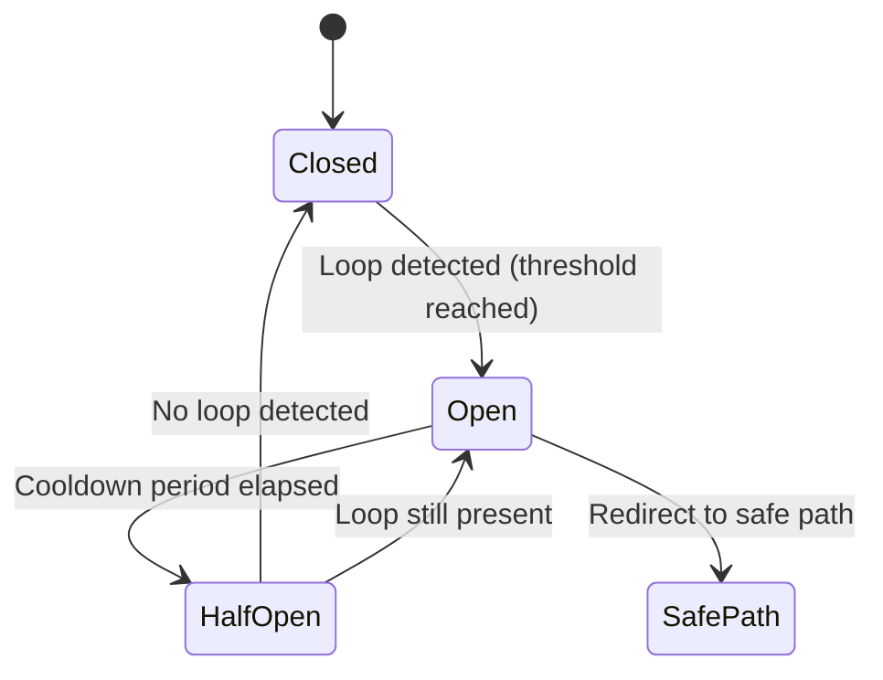

# Redirect Loop Prevention with Circuit Breaker Pattern

## Overview

This feature implements a robust redirect loop prevention mechanism using the Circuit Breaker pattern to protect the application from infinite redirect loops that can occur due to misconfigured routes, authentication issues, or other edge cases.

## Key Features

### 1. **Circuit Breaker Pattern**
- **Closed State**: Normal operation, monitoring for redirect loops
- **Open State**: Loop detected, blocking requests and redirecting to safe paths
- **Half-Open State**: Testing if the issue is resolved after cooldown period

### 2. **Intelligent Loop Detection**
- Detects simple self-redirects (A→A)
- Identifies A→B→A patterns
- Recognizes complex repeating patterns
- Uses request fingerprinting to isolate detection per user/session

### 3. **Safe Path Exclusions**
Critical paths are excluded from loop detection to prevent lockouts:
- Authentication paths (`/sessions`, `/mfa`)
- Onboarding paths (`/onboarding`)
- API endpoints (`/api`)
- Asset paths (`/assets`, `/packs`)
- Health check endpoints (`/health`, `/up`)

### 4. **Self-Hosted Mode Support**
Self-hosted instances bypass loop detection to allow custom redirect flows.

## Configuration

Configure the feature in `config/initializers/redirect_loop_prevention.rb`:

```ruby
Rails.application.configure do
  config.redirect_loop_prevention = ActiveSupport::OrderedOptions.new
  
  # Paths excluded from loop detection
  config.redirect_loop_prevention.safe_paths = %w[
    /sessions /onboarding /mfa /api /health
  ]
  
  # Maximum redirect history depth to analyze
  config.redirect_loop_prevention.max_depth = 5
  
  # Failures before opening circuit breaker
  config.redirect_loop_prevention.failure_threshold = 3
  
  # Cooldown period before retry
  config.redirect_loop_prevention.cooldown_period = 30.seconds
  
  # Enable verbose logging
  config.redirect_loop_prevention.verbose_logging = Rails.env.development?
  
  # Enable monitoring integration
  config.redirect_loop_prevention.monitoring_enabled = Rails.env.production?
end
```

## How It Works

### 1. Request Fingerprinting
Each request is fingerprinted based on:
- IP address
- User agent
- Session ID

This isolates circuit breakers per user/session to prevent false positives from shared IPs.

### 2. Loop Detection Algorithm

The system detects loops through multiple mechanisms:

#### Simple Self-Redirect
```
Page A → Page A (with same referrer)
```

#### A-B-A Pattern
```
Page A → Page B → Page A → Page B
```

#### Complex Patterns
The algorithm analyzes recent navigation history to identify repeating sequences.

### 3. Circuit Breaker States



### 4. Error Handling

When a loop is detected:
1. User is redirected to a safe path
2. If already at safe path, an error page is rendered
3. Circuit history is cleared to prevent stale data
4. Incident is logged and reported to monitoring

## Security Considerations

### 1. **Privacy Protection**
- User IDs and IPs are only logged, not stored permanently
- Session fingerprints use hashing for privacy
- Old circuit data is automatically cleaned up

### 2. **DoS Prevention**
- Circuit breakers prevent infinite redirect loops from consuming resources
- Automatic cleanup prevents session bloat
- Rate limiting through failure thresholds

### 3. **Authentication Flow Protection**
- Critical auth paths are excluded from detection
- Self-hosted mode bypass for custom flows
- Graceful fallbacks for missing user/family data

## Monitoring and Debugging

### Development Mode
- Verbose logging enabled by default
- Detailed loop detection information in logs
- Circuit state visible in Rails logs

### Production Mode
- Sentry integration for loop detection alerts
- Minimal logging to reduce noise
- Metrics tracking for circuit breaker states

### Log Examples

```ruby
# Loop detected
[REDIRECT_LOOP_DETECTED] Path: /dashboard
[REDIRECT_LOOP_DETECTED] Recent history: /login -> /dashboard -> /login -> /dashboard
[REDIRECT_LOOP_DETECTED] User: 123
[REDIRECT_LOOP_DETECTED] IP: 192.168.1.1

# Circuit breaker opened
[REDIRECT_LOOP_CRITICAL] Circuit breaker opened after 3 failures

# Circuit recovery
[REDIRECT_LOOP_RECOVERY] Circuit transitioning to half-open state
[REDIRECT_LOOP_RECOVERY] Circuit fully closed, normal operation resumed
```

## Testing

The feature includes comprehensive tests covering:
- Normal navigation (no false positives)
- Loop detection scenarios
- Circuit breaker state transitions
- Error handling and edge cases
- Self-hosted mode bypass
- Invalid timestamp handling
- Session cleanup

Run tests with:
```bash
rails test test/controllers/concerns/redirect_loop_prevention_test.rb
```

## Troubleshooting

### Issue: Users getting redirected unexpectedly
1. Check if the path should be in safe_paths
2. Verify self-hosted mode configuration
3. Review recent deployment changes to routes

### Issue: Loops not being detected
1. Verify the concern is included in ApplicationController
2. Check that the path isn't in safe_paths
3. Ensure the request is GET + HTML format

### Issue: Circuit breaker not recovering
1. Check cooldown_period configuration
2. Verify timestamp parsing in logs
3. Manually clear session data if needed

## Performance Impact

- Minimal overhead: ~1-2ms per request
- Session storage: ~500 bytes per circuit
- Automatic cleanup prevents session bloat
- O(n) complexity for pattern detection where n = history_size

## Future Improvements

1. **Machine Learning Integration**: Detect anomalous navigation patterns
2. **User Feedback**: Allow users to report false positives
3. **Admin Dashboard**: Visualize circuit breaker states
4. **Custom Recovery Strategies**: Configurable per-path recovery
5. **Distributed Circuit Breakers**: Share state across servers